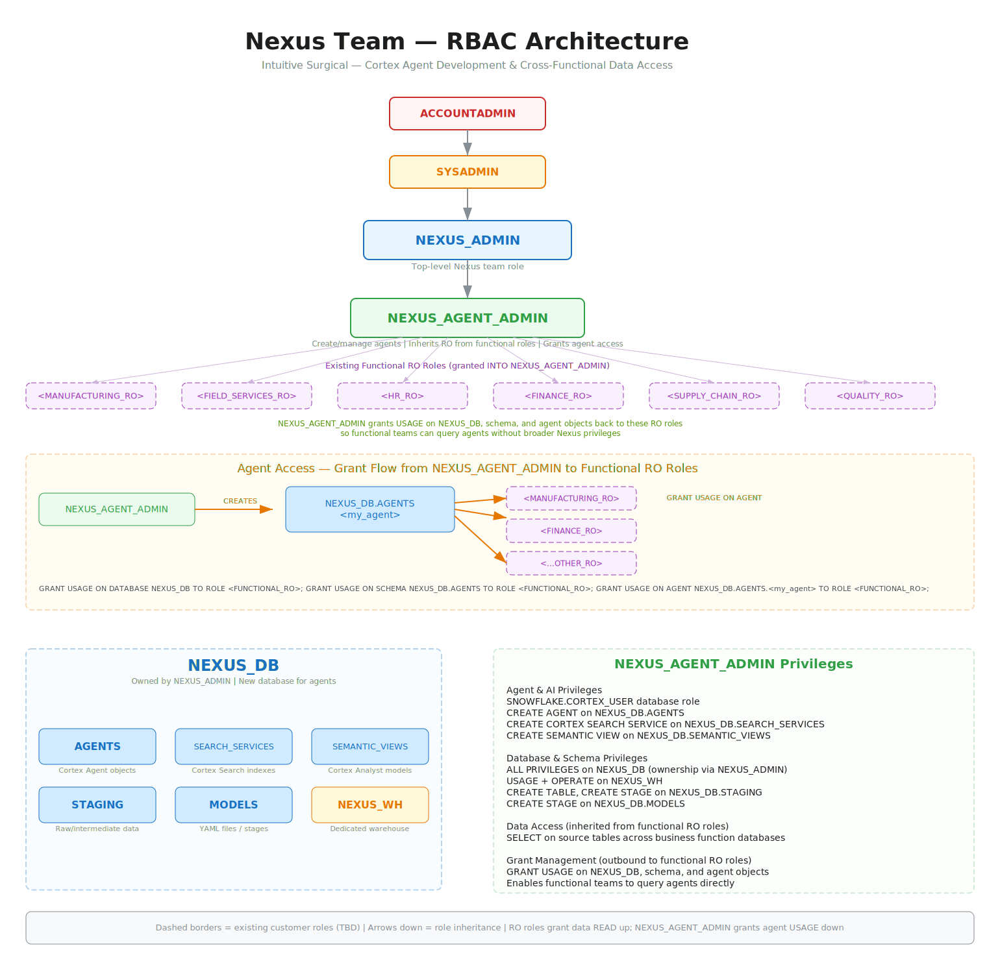

# Nexus Team — RBAC Design Principles

**Team:** Nexus (Cross-Functional Chatbot / Cortex Agent Development)
**Prepared by:** Snowflake SE

---

## Architecture Diagram



---

## Overview

The Nexus team is building an external chatbot powered by Snowflake Cortex Agents. The team requires:

- **Cross-functional read access** across manufacturing, field services, HR, finance, supply chain, and quality databases
- **A dedicated database** (`NEXUS_DB`) to create and manage Cortex Agents, Search Services, and Semantic Views
- **The ability to grant agent access** back to existing functional read-only roles so business teams can query agents directly

## Design Principles

### 1. Minimal Custom Roles

Only **two custom roles** are introduced:

| Role | Purpose |
|------|---------|
| `NEXUS_ADMIN` | Top-level Nexus team role. Owns `NEXUS_DB`. Manages role grants and database-level administration. |
| `NEXUS_AGENT_ADMIN` | Operational role for creating/managing agents, search services, and semantic views. Inherits data read access from functional RO roles. Grants agent usage back to those roles. |

**Why only two?** The Nexus team members are both developers and administrators — there is no need for separate dev/user tiers. End-user access to the chatbot is handled at the application layer, not through Snowflake roles.

### 2. Leverage Existing Roles — Don't Duplicate

Functional read-only roles (e.g., `MANUFACTURING_RO`, `FINANCE_RO`) already exist in the customer's RBAC hierarchy. Rather than creating new umbrella roles or duplicating grants:

- **Existing RO roles are granted INTO `NEXUS_AGENT_ADMIN`** — this gives the Nexus team inherited SELECT access across business function databases
- **No new data reader role is needed** — granting RO roles directly into `NEXUS_AGENT_ADMIN` avoids an unnecessary hop

### 3. Bidirectional Grant Pattern

The architecture uses a deliberate bidirectional flow:

```
Functional RO Roles ──(grant data READ)──▶ NEXUS_AGENT_ADMIN
                                                │
NEXUS_AGENT_ADMIN ──(grant agent USAGE)──▶ Functional RO Roles
```

- **Inbound (data read):** RO roles are granted to `NEXUS_AGENT_ADMIN` so the agent admin inherits SELECT on source tables. This is standard Snowflake role inheritance.
- **Outbound (agent access):** `NEXUS_AGENT_ADMIN` grants USAGE on `NEXUS_DB`, the `AGENTS` schema, and individual agent objects back to the functional RO roles. This allows business teams to query agents without receiving any broader Nexus privileges.

### 4. Three-Level Agent Access Grant

For a functional role to query an agent, three grants are required:

```sql
GRANT USAGE ON DATABASE NEXUS_DB TO ROLE <FUNCTIONAL_RO>;
GRANT USAGE ON SCHEMA NEXUS_DB.AGENTS TO ROLE <FUNCTIONAL_RO>;
GRANT USAGE ON AGENT NEXUS_DB.AGENTS.<agent_name> TO ROLE <FUNCTIONAL_RO>;
```

This follows Snowflake's standard object access model (database → schema → object). `NEXUS_AGENT_ADMIN` is given `GRANT` option on these objects to manage this independently.

### 5. Dedicated Database with Purpose-Built Schemas

`NEXUS_DB` is organized into schemas by object type:

| Schema | Contents |
|--------|----------|
| `AGENTS` | Cortex Agent objects |
| `SEARCH_SERVICES` | Cortex Search Service indexes |
| `SEMANTIC_VIEWS` | Semantic Views for Cortex Analyst |
| `STAGING` | Raw/intermediate data, working tables |
| `MODELS` | YAML agent specification files (via stages) |

### 6. Dedicated Warehouse

`NEXUS_WH` is a dedicated warehouse for the Nexus team. It is required for:

- Cortex Search Service refresh operations
- Agent query execution
- Data staging and transformation

`NEXUS_AGENT_ADMIN` receives USAGE + OPERATE on this warehouse.

### 7. Cortex-Specific Database Roles

`NEXUS_AGENT_ADMIN` is granted the following Snowflake database roles:

- `SNOWFLAKE.CORTEX_USER` — required for invoking Cortex LLM functions
- `SNOWFLAKE.CORTEX_AGENT_USER` — required for creating and managing Cortex Agents

These are pre-existing database roles in the `SNOWFLAKE` shared database, not custom roles.

### 8. Standard Role Hierarchy Integration

The custom roles integrate cleanly into Snowflake's standard hierarchy:

```
ACCOUNTADMIN
  └── SYSADMIN
        └── NEXUS_ADMIN          (owns NEXUS_DB, manages grants)
              └── NEXUS_AGENT_ADMIN  (creates agents, inherits RO data)
                    ├── <MANUFACTURING_RO>
                    ├── <FIELD_SERVICES_RO>
                    ├── <HR_RO>
                    ├── <FINANCE_RO>
                    ├── <SUPPLY_CHAIN_RO>
                    └── <QUALITY_RO>
```

`NEXUS_ADMIN` is granted to `SYSADMIN` so it participates in the standard administrative hierarchy. Functional RO roles (shown in angle brackets) are existing customer roles — they are not created by this design.

## Security Considerations

- **Least privilege:** `NEXUS_AGENT_ADMIN` only inherits READ from functional roles — it cannot write to business function databases
- **Grant isolation:** Agent USAGE grants to functional roles do not confer any other Nexus privileges (no access to staging, models, search services, etc.)
- **No direct ACCOUNTADMIN dependency:** All operations are performed through `NEXUS_ADMIN` and `NEXUS_AGENT_ADMIN`, never requiring ACCOUNTADMIN for day-to-day work
- **Auditable:** All grants flow through named roles, making access reviews straightforward via `SHOW GRANTS`

## Files

| File | Description |
|------|-------------|
| `nexus_rbac_architecture.svg` | Architecture diagram (embedded above) |
| `nexus_rbac_architecture.excalidraw` | Editable source diagram (open in Excalidraw) |
| `nexus_rbac.sql` | SQL DDL to implement this RBAC hierarchy |
| `nexus_rbac_design.md` | This document |
